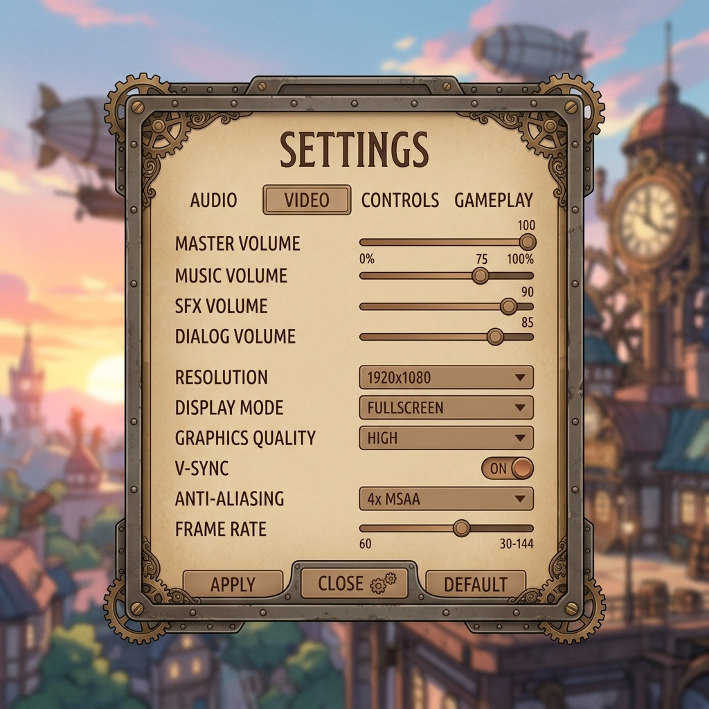

# 設定 仕様

## 機能一覧

| # | 機能名 | 説明 |
|---|--------|------|
| 1 | 設定ダイアログ表示 | タイトル画面から設定ダイアログをオーバーレイ表示する |
| 2 | タブ切り替え | 「画面設定」「音声設定」タブを切り替えて設定項目を表示する |
| 3 | 画面設定 | 画面に関する設定を変更する |
| 4 | 音声設定 | 音量に関する設定を変更する |
| 5 | 設定の保存 | 変更した設定をファイルへ保存し、即時反映する |
| 6 | 設定ダイアログを閉じる | 「閉じる」ボタンまたはパネル外クリックでダイアログを閉じる |

## 操作方法

| 入力 | アクション |
|------|-----------|
| 「画面設定」タブをクリック | 画面設定の項目を表示する |
| 「音声設定」タブをクリック | 音声設定の項目を表示する |
| 各設定項目を操作 | 設定値を変更し、即時反映する |
| 「閉じる」ボタンをクリック | 設定ダイアログを閉じる |
| ダイアログ外をクリック | 設定ダイアログを閉じる |

## 各ゲーム状態の詳細

### 設定ダイアログ（画面設定タブ）

- **表示内容**: タブ（画面設定・音声設定）、画面設定の各項目、「閉じる」ボタン
- **プレイヤー操作**: 設定値の変更、タブ切り替え、ダイアログを閉じる
- **遷移条件**: 「閉じる」クリック or ダイアログ外クリック
- **遷移先**: 呼び出し元の状態に戻る（タイトル画面の通常待機）

### 設定ダイアログ（音声設定タブ）

- **表示内容**: タブ（画面設定・音声設定）、音声設定の各項目、「閉じる」ボタン
- **プレイヤー操作**: 設定値の変更、タブ切り替え、ダイアログを閉じる
- **遷移条件**: 「閉じる」クリック or ダイアログ外クリック
- **遷移先**: 呼び出し元の状態に戻る（タイトル画面の通常待機）

## 画面設定

> 設定項目の詳細は今後追加予定。

| 設定項目 | 型 | 備考 |
|---------|---|------|
| （今後追加） | — | — |

## 音声設定

> 設定項目の詳細は今後追加予定。

| 設定項目 | 型 | 備考 |
|---------|---|------|
| （今後追加） | — | — |

## 設定の保存・読み込み

- 設定値はアプリ終了後も保持する（PlayerPrefs または専用の設定ファイルに書き出す）
- 変更は即時反映する（「適用」ボタンは設けない）
- アプリ起動時に保存済み設定を読み込む。読み込みに失敗した場合はデフォルト値を使用する

## エラー / 異常ケース

| 条件 | 挙動 |
|------|------|
| 設定ファイルの読み込みに失敗 | デフォルト値で起動し、エラーをログ出力 |
| 設定ファイルへの書き込みに失敗 | エラーをログ出力（ゲームは継続） |

## 未対応ケース

- 設定のリセット（デフォルト値に戻す）機能（将来対応）
- タイトル画面以外からの設定呼び出し（将来対応）
- キーボード・コントローラーでの操作（将来対応）
